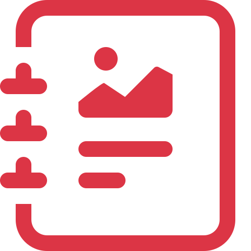

# CookGuide

<!--suppress HtmlDeprecatedAttribute -->

CookGuide is a server-side tool for managing cooking recipes.

*WARNING: This software is not ready for production yet as some important features and tests are still missing (although I am personally using it
productively).*

 

## Features

- Import recipes from foreign pages

## Installation

See [Setup](docs/setup.md)

## Contributing

Pull requests are welcome. For major changes, please open an issue first to discuss what you would like to change.

Please make sure to update tests as appropriate.

Please see [Development](docs/development.md) for information on how to set up your local development environment.

## License

[MIT](https://choosealicense.com/licenses/mit/)

## Acknowledgements

* [Deno: A secure runtime for JavaScript and TypeScript](https://deno.land/)
* [TypeScript](https://www.typescriptlang.org/)
* [Bootstrap](https://getbootstrap.com/)
* [ESBuild](https://esbuild.github.io/)
* [Oak](https://oakserver.github.io/oak/)
* [deno_dom](https://github.com/b-fuze/deno-dom)
* [deno-sqlite](https://github.com/dyedgreen/deno-sqlite)
* [parse-ingredient](https://jakeboone02.github.io/parse-ingredient/)
* [IntelliJ](https://www.jetbrains.com/idea/)
* [Nextcloud Cookbook](https://github.com/nextcloud/cookbook)
