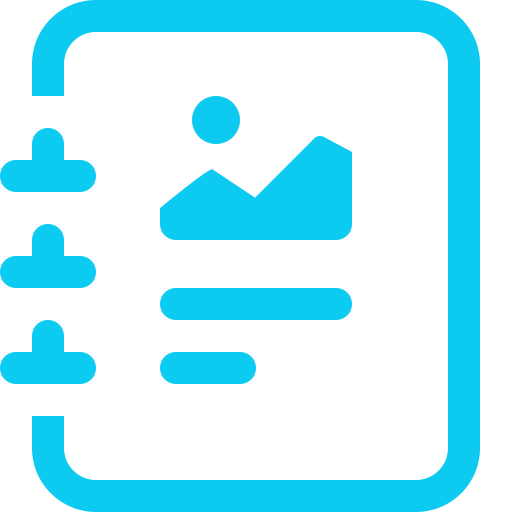
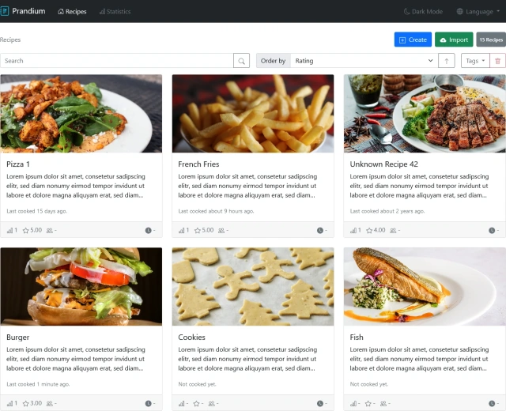

# Prandium

<!--suppress HtmlDeprecatedAttribute -->

Prandium, latin for [lunch](https://en.wiktionary.org/wiki/prandium), is a single-user content management system for organizing recipes.

*WARNING: This software is not ready for production yet as some important features and tests are still missing (although I am personally using it on a
daily basis).*

 

## Features

- Import recipes by URL from websites that use [schema.org](https://schema.org/) JSON-LD microdata
- Keep track of when and how often you cooked a recipe
- Assign tags to each recipe to easily find them later
- Mobile friendly: Responsive, fast and niche features such as keeping your screen active while you are on a recipe page

## Installation

See [Setup](docs/setup.md)

## Screenshots

<table>
   <tr>
      <th>Light (default)</th>
      <th>Dark</th>
   </tr>
   <tr>
      <th colspan="2" style="text-align: center">Recipe List</th>
   </tr>
   <tr>
      <td>
         
      </td>
      <td>
         
      </td>
   </tr>
</table>

## Contributing

Pull requests are welcome. For major changes, please open an issue first to discuss what you would like to change.

Please make sure to update tests as appropriate.

Please see [Development](docs/development.md) for information on how to set up your local development environment.

## License

[MIT](https://choosealicense.com/licenses/mit/)

## Acknowledgements

* [Deno: A secure runtime for JavaScript and TypeScript](https://deno.land/)
* [TypeScript](https://www.typescriptlang.org/)
* [Bootstrap](https://getbootstrap.com/)
* [ESBuild](https://esbuild.github.io/)
* [Oak](https://oakserver.github.io/oak/)
* [deno_dom](https://github.com/b-fuze/deno-dom)
* [deno-sqlite](https://github.com/dyedgreen/deno-sqlite)
* [parse-ingredient](https://jakeboone02.github.io/parse-ingredient/)
* [IntelliJ](https://www.jetbrains.com/idea/)
* [Nextcloud Cookbook](https://github.com/nextcloud/cookbook)
